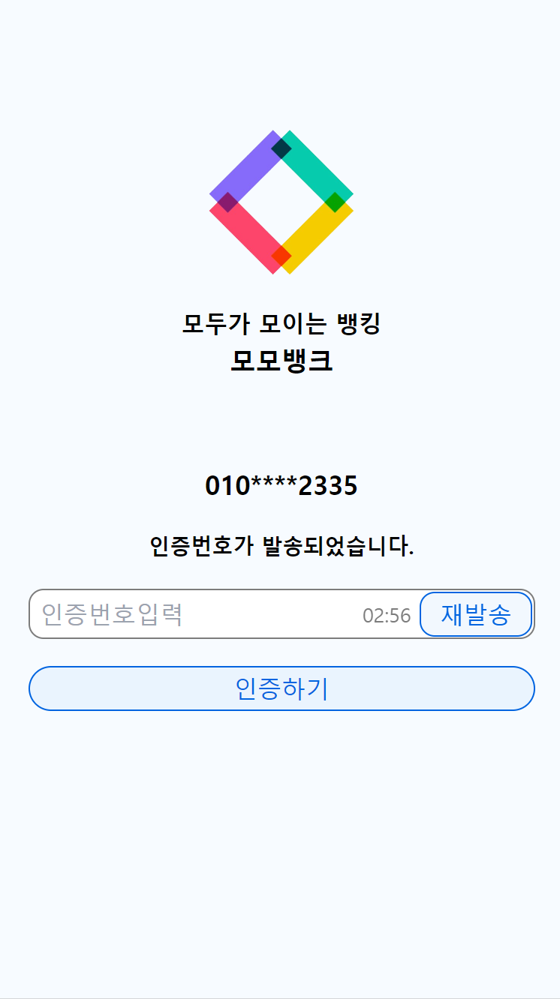
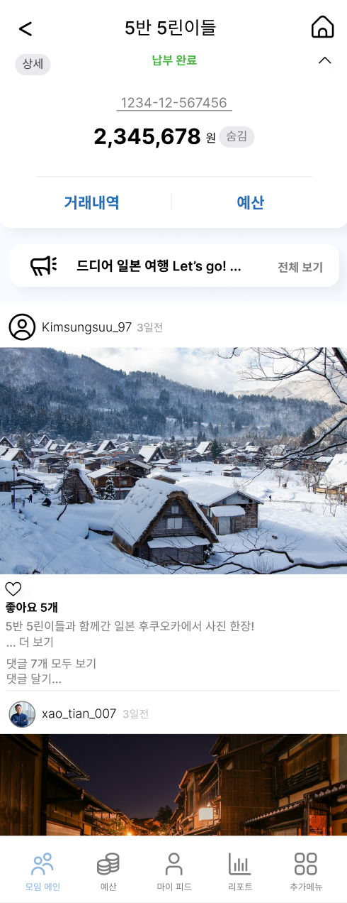

<p align="center">
  
</p>

<br>

## 개요

프로젝트명: 모모뱅크

프로젝트 기간(6주): 2024.02.26 ~ 2024.04.05

팀원(6명): 손준성(Back-Infra), 곽민우(Back-Infra), 명소이(Back-Api), 이효리(Back-api), 김성수(front), 엄세현(front)

## 소개

모모뱅크는 사용자들이 모임별로 회비를 편리하게 관리하고, 모임의 성격에 따라 최적의 통장 및 카드를 추천받고 적용할 수 있는 모임 특화 금융 관리 플랫폼입니다. 이를 통해 사용자는 모임 활동을 더 활성화하고, 모임원 간의 유대감을 강화할 수 있습니다.

안정적인 서비스를 제공하기 위해 MSA(Microservices Architecture) 구조로 설계하였으며, Kafka를 이용한 마이크로서비스 간의 효율적인 비동기 통신을 지원합니다. 이러한 구조는 각각의 서비스가 독립적으로 운영될 수 있게 해주며, 서비스 간의 데이터 동기화 및 통신의 복잡성을 줄여줍니다.

또한, Kubernetes를 사용하여 마이크로서비스의 지속적인 관리 및 운영을 자동화합니다. Kubernetes의 자동 회복, 무중단 배포 기능을 통해 서비스의 안정성과 가용성을 높이며, 장애 발생 시 카프카를 통한 데이터 동기화 기능으로 데이터 일관성을 유지합니다.

## 배경

- 기존 금융상품의 사용 제약과 모임 맞춤형 서비스의 부재
- 모임 활동을 온라인 환경으로 확장시킬 필요성

## 목표

- 모임별 회비 관리의 편리성 제공
- 사용자에게 맞춤형 통장 및 카드 추천
- 소비 내역 공유를 통한 투명성 강화
- 모임 활동 지원을 위한 다양한 부가 기능 제공

## 주요 기능

- **통장 및 카드 추천 서비스**: 모임의 특성을 고려한 맞춤형 추천
- **모임 회비 관리 기능**: 투명한 관리와 실시간 정보 제공
- **모임 게시판 및 커뮤니티**: 다양한 소통 지원 기능
- **모임 리포트 제공**: 활동 분석 및 향후 계획 지원
- **활동 추천 서비스**: 모임원 만족도 높은 활동 추천

## 기대 효과

- 금융 관리의 투명성 및 신뢰도 향상
- 모임 활동의 활성화
- 모임원 간 유대감 강화

## 시스템 구성도

<p align="center">
  
</p>

```jsx
[ 클라이언트 ]
   │
   └─> [ Nginx 리버스 프록시 - SSL ]
         │
         ├─> [ 프론트엔드 서비스 ] ──> [ 웹 서버: Nuxt.js ]
         │
         └─> [ Spring Cloud Gateway - Spring Security ]
               │
               ├───> [ 사용자 서비스 ] ───> [ 데이터베이스: MariaDB ]
               │     │
               │     └─> [ 회원 & 모임 관리 ]
               │
               ├───> [ 커뮤니티 서비스 ] ──> [ 데이터베이스: MariaDB ]
               │     │
               │     └─> [ 게시글 & 댓글 & 리포트 ]
               │
               └───> [ 금융 서비스 ] ─────> [ 데이터베이스: OracleDB ]
                     │
                     └─> [ 계좌 관리 & 거래 처리 ]
```

## 환경 상세

### IDE

- IntelliJ UE 2023.3.2
- Visual Studio Code

### Server

- AWS EC2 Lightsail
  - Ubuntu 20.04
  - Kubernetes v1.28.7+k3s1
- Kubernetes Cluster Components
  - Jenkins 2.440.1
  - Kafka Clients 3.7.0.jar
  - MariaDB 11.3.2
  - Oracle 23c
  - Ingress NginX 1.10.0

### Frontend

- Nuxt.js 3.10.3
- Sass
- Tailwind CSS 6.11.4
- Axios
- Pinia

### Backend

- Java OpenJDK 17
- Gradle 8.5
  - Spring Data JPA
  - Spring Data Redis
  - Spring Data Elasticsearch
  - Lombok
  - Querydsl

### Microservices Architecture

- **Services**: Community, User, Bank
- **Communication**: Kafka
- **Security & API Gateway**: Gateway service
- **SSL Certification**: Ingress NginX

## 데이터베이스 ERD

MSA구조로 다음과같이 세 개의 ERD가 존재합니다.

- **User**: MariaDB

<p align="center">
  
</p>

- **Bank**: Oracle DB

<p align="center">
  
</p>

- **Community**: MariaDB

<p align="center">
  
</p>

<a name="intro"></a>

## 📢 　 Site Layout

- 초기화면

  
   

- 회원가입

  
  
  
  

- 뱅킹 메인

  

- 계좌 목록

  

- 모임 목록

  

- 계좌 개설

  
  
  
  
  
  
  
  

- 거래내역

  

- 송금

  
  
  
  
  
  

- 모임　메인

  

- 모임 상세

  
  
  

- 예산

  
  
  

  - 피드

  
  
  

- 모임 인원(관리자)

  

- 공지사항

  
  
  

<br>

<a name="roles"></a>

## 🙋‍♂️ Distributed Roles

### BACKEND

#### 이효리 (팀장)

#### 명소이

#### 곽민우

#### 손준성

### FRONTEND

#### 엄세현

- 프론트엔드 리더
- 초기 개발 환경 구축
- 로그인, 회원가입 페이지 제작
- 뱅킹 담당
  - 페이지 디자인
  - 페이지 제작
    - 뱅킹 메인 페이지
    - 계좌 개설
    - 계좌 내역
    - 계좌 송금
    - 사용자 성향 조사
    - 카드 추천
  - 컴포넌트 제작
  - 뱅킹 Axios
- Axios 전역화
- 비 로그인 라우팅 기능

#### 김성수

- 프론트엔드 멤버
- 모임 담당

<br>

<br>

<a name="function"></a>

## ⚙️ Function

### 회원

💡 회원은 Pinia를 통한 스토어 관리로 구현

- [x] 휴대폰 인증을 통한 회원가입
- [x] 휴대폰 번호 중복 검사
- [x] 로그인
- [x] 로그아웃
- [x] 비밀번호 찾기

### 뱅킹

💡 계좌 개설부터 송금이 가능한 뱅킹 어플 구현

- [x] 메인 페이지
- [x] 전체계좌
- [x] 전체모임
- [x] 계좌개설
- [x] 프로필
- [x] 거래내역
- [x] 송금
- [x] 사용자 성향 파악 설문
- [x] 카드추천

### 모임

💡 피드, 리포트를 통한 소통 개선 및 손쉬운 납부 확인이 가능한 모임 통장 기능 구현

- [x] 메인 페이지
- [x] 모임 상세
- [x] 예산 관리
- [x] 입금 현황
- [x] 전체 인원 확인
- [x] 공지사항 작성/수정/삭제
- [x] 피드 작성/수정/삭제
- [x] 관리자 권한
- [x] 초대코드 모임 초대
- [x] 리포트
- [ ] 피드 댓글

<br>
